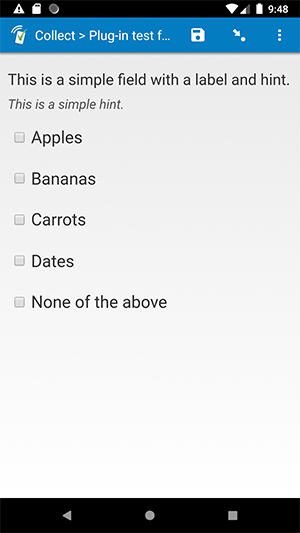

# Baseline select_multiple field

## Description

A simple replacement for the default select_multiple field, plus a few improvements (see below). You can either download and use this as-is, or you can use it as a starting template when creating your own field plug-in for a select_multiple field.

## Default SurveyCTO feature support

| Feature / Property | Support |
| --- | --- |
| Supported field type(s) | `select_multiple`|
| Default values | Yes |
| Custom constraint message | Yes |
| Custom required message | Yes |
| Read only | Yes |
| media:image | Yes |
| media:audio | Yes |
| media:video | Yes |
| `minimal` appearance | No |
| `compact` appearance | No |
| `compact-#` appearance | No |

## Expanded feature support

In addition to supporting the default SurveyCTO features listed above, this field plug-in offers the following expanded functionality:

1. Support for RTL languages  
    If your *label*, *hint*, or choice labels are in a language that uses a right-to-left alphabet (like Arabic), they will be right-justified, and the checkboxes will be to the right of the choice labels. If your form contains both right-to-left and left-to-right choice labels, the formatting will respond to the currently-selected form language.
1. Support for HTML in choice labels  
    This plug-in will allow HTML in choice labels to be rendered as HTML, even in Collect on Android and iOS.
1. Support for HTML in field references  
    If you reference another field's value in either the field *label* or field *hint*, and that referenced value contains HTML, the HTML will be correctly rendered.

## How to use

**To use this plug-in as-is**, just download the [baseline-select_multiple.fieldplugin.zip](https://github.com/surveycto/baseline-select_multiple/raw/master/baseline-select_multiple.fieldplugin.zip) file from this repo, and attach it to your form.

To create your own field plug-in using this as a template, follow these steps:

1. Fork this repo
1. Make changes to the files in the `source` directory.

    * **Note:** be sure to update the `manifest.json` file as well.

1. Zip the updated contents of the `source` directory.
1. Rename the .zip file to *yourpluginname*.fieldplugin.zip (replace *yourpluginname* with the name you want to use for your plug-in).
1. You may then attach your new .fieldplugin.zip file to your form as normal.

## More resources

* **Test form**  
This form will help you explore the differences between this field plug-in and the default text field.  
[Download test form package](https://github.com/surveycto/baseline-select_multiple/raw/master/extras/test-form/test-form-package-baseline-select_multiple.zip)  
[Instructions for test form](/extras/test-form/README.md)

* **Developer documentation**  
Instructions and resources for developing your own field plug-ins.  
[https://github.com/surveycto/Field-plug-in-resources](https://github.com/surveycto/Field-plug-in-resources)

* **User documentation**  
How to get started using field plug-ins in your SurveyCTO form.  
[https://docs.surveycto.com/02-designing-forms/03-advanced-topics/06.using-field-plug-ins.html](https://docs.surveycto.com/02-designing-forms/03-advanced-topics/06.using-field-plug-ins.html)
